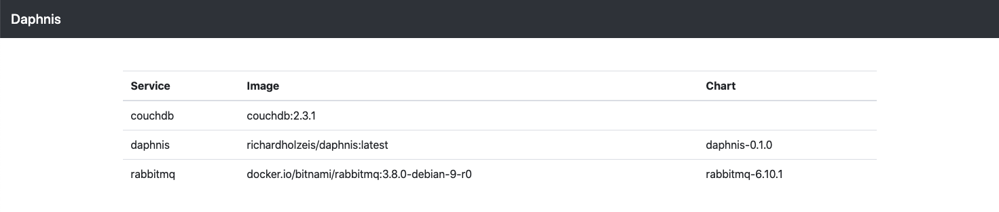

# Daphnis

A simple web application listing installation information to installed pods.

## Running Daphnis

Daphnis will only work executed from within a kubernetes cluster as it will try to access the default service account for authentication against the kubernetes api.

If you have RBAC enabled on your cluster, use the following snippet to create role binding which will grant the default service account view permissions.

    kubectl create clusterrolebinding default-view --clusterrole=view --serviceaccount=default:default

## Install Daphnis

    helm install daphnis chart

Go to `http://example.local/info/default` to list all pods within the default namespace.
 
